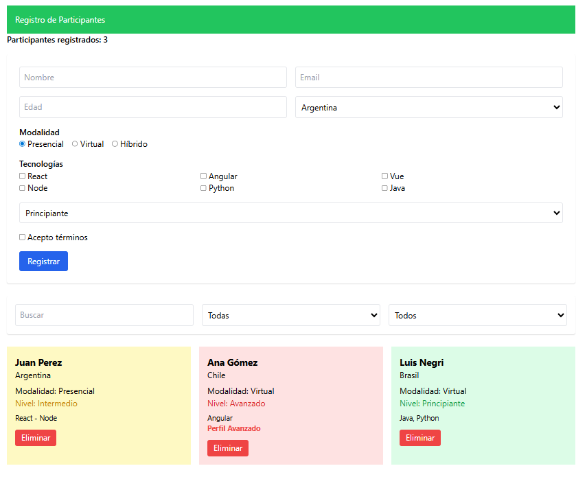

<!-- UTN FACULTAD 米 REGIONAL MENDOZA UNIVERSIDAD TECNOLOGICA NACIONAL -->

# Trabajo Practico No 2 - Programación 4

# Sistema de Registro de Eventos Tecnológicos

# Tecnologías

·React

·Vite

· TailwindCSS

# Creación del Proyecto

Crear el proyecto con **Vite:**

npm create vite@latest registro-eventos

Seleccionar:

React

TypeScript

| D:\ProyectosReact&gt;npm create vite@latest registro-eventos Need to install the following packages: create-vite@9.0.3 Ok to proceed? (y) y Select a framework: React Select a variant: &gt;TypeScript TypeScript + React Compiler JavaScript JavaScript + React Compiler RSC React Router v7 https://reactrouter.com TanStack Router https://tanstack.com/router RedwoodSDK https://rwsdk.com Vike https://vike.dev |
| --- |

cd registro-eventos

npm install (solo si deseamos reinstalar la nodemodules)

# Instalar TailwindCSS:

npm install -D tailwindcss@3 postcss autoprefixer (usaremos la v3 que es mas estable)

<!-- UTN FACULTAD REGIONAL MENDOZA UNIVERSIDAD TECNOLOGICA NACIONAL -->

Verifique que su archivo index.css inicie con

**@tailwind** base;

**@tailwind** components;

**@tailwind** utilities;

# Ejecutar el proyecto React

**npm run dev**

D:\ProyectosReact\registro-eventos&gt;npm run dev

**&gt;registro-eventos@0.0.0** dev

**&gt;vite**

11:**13:33** **[vite]** (client) Re-optimizing dependencies because lockfile has changed

**VITE** v8.0.1 ready in 504 ms

**■ Local: http://localhost:5173/**

**Network: use --host to** expose

**press h + enter to show help**

# Objetivo

Desarrollar una interfaz web para registrar **participantes** **de** **un** **evento** **tecnológico** utilizando **formularios completos y grillas responsive con TailwindCSS.**

Se evaluará principalmente:

**·** Uso de **TailwindCSS**

·Uso de **Grid y Flex**

·Diseño **responsive**

**·** Implementación de **componentes de formulario**

# 1. Estructura de la Aplicación

La aplicación tendrá tres secciones:

Registro de Participantes

[ Formulario de inscripción ]

[ Filtros de búsqueda ]

<!-- UTN FACULTAD REGIONAL MENDOZA UNIVERSIDAD TECNOLOGICA NACIONAL -->

[ Lista de poarticipantes ]

# 2. Datos de Participantes

Cada participante tendrá la siguiente estructura:

{

id: 1,

nombre: "Juan Perez",

email:"juan@mail.com",

edad: 25,

pais:"Argentina",

modalidad:"Presencial",

tecnologias:["React", $"Node"]$ 

nivel: "Intermedio",

aceptaTerminos: true

}

# 3. Formulario de Registro

El formulario debe permitir registrar un nuevo participante.

Campos requeridos

| Campo | Tipo de componente |
| --- | --- |
| Nombre | input text |
| Email | input email |
| Edad | input number |
| País | select |
| Modalidad de asistencia |  radio button |
| Tecnologías conocidas  | checkbox |
| Nivel de experiencia | select |

Acepta términos

checkbox

<!--  -->

<!-- **UTN** FACULTAD REGIONAL MENDOZA -->

<!-- UNIVERSIDAD TECNOLOGICA NACIONAL -->

**Campo**

**Tipo de componente**

Botón enviar

button

# 4. Diseño del Formulario (Grid)

El formulario debe organizarse utilizando **Tailwind** **Grid.**

Ejemplo de estructura:

Nombre

Email

Edad

País

Modalidad

Tecnologías

Nivel

Acepta términos

[Registrar Participante]

Ejemplo de clases esperadas:

grid grid-cols-1 md:grid-cols-2 gap-4

# 5. Campo Select (País)

El select debe contener al menos:

Argentina

Chile

Uruguay

México

España

<!-- UTN FACULTAD REGIONAL MENDOZA UNIVERSIDAD TECNOLOGICA NACIONAL -->

## País

[ Argentina-]

# 6. Radio Buttons (Modalidad)

Opciones:

o Presencial

o Virtual

o Híbrido

Ejemplo en Tailwind:

flex gap-4

# 7. Checkboxes (Tecnologías)

El participante puede seleccionar varias:

☐React

☐Angular

☐Vue

☐Node

☐Python

☐Java

Diseño sugerido:

grid grid-cols-2 md:grid-cols-3

# 8. Nivel de Experiencia

Select con opciones:

Principiante

Intermedio

Avanzado

# 9. Aceptación de términos

Checkbox obligatorio:

Acepto los términos y condiciones del evento

<!-- UTN FACULTAD REGIONAL MENDOZA UNIVERSIDAD TECNOLOGICA NACIONAL -->

# 10. Botón de Envío

Debe usar clases de Tailwind como:

bg-blue-600

text-white

px-4

py-2

rounded

hover:bg-blue-700

# 11. Lista de Participantes

Debajo del formulario se mostrará la lista de participantes registrados.

Debe mostrarse en **tarjetas usando grid responsive.**

Ejemplo:

+

Juan Perez

Argentina

Modalidad: Presencial

Nivel: Intermedio

Tecnologías:

React - Node

+-

## Grid sugerido:

grid grid-cols-1 md:grid-cols-2 lg:grid-cols-3 gap-4

# 12. Filtros de Búsqueda

Agregar una sección de filtros con:

**Campo**

**Tipo**

<!--  -->

<!-- **UTN** FACULTAD REGIONAL MENDOZA -->

<!-- UNIVERSIDAD TECNOLOGICA NACIONAL -->

**Campo**

**Tipo**

Buscar por nombre input text

Filtrar por modalidad select

Filtrar por nivel

select

Ejemplo visual:

Buscar: [

Modalidad: [Todas▼]

Nivel: [Todos ▼]

# 13. Estilo General de la Página

Contenedor principal:

max-w-6xl

mx-auto

p-6

Título principal:

text-3xl

font-bold

text-center

mb-6

Tarjetas de participantes:

bg-white

shadow

rounded

p-4

hover:shadow-lg

transition

# 14. Requisitos Técnicos

## La aplicación debe utilizar:

<!-- UTN FACULTAD REGIONAL MENDOZA UNIVERSIDAD TECNOLOGICA NACIONAL -->

· useState

· Manejo de formularios en React

·Renderizado dinámico de listas

TailwindCSS para todo el diseño

# 15. Responsive Design

El diseño debe adaptarse a:

# Dispositivo Comportamiento

Celular

1 columna

Tablet

2 columnas

Desktop

3 columnas

## 16. Puntos Extra

Implementar alguna de estas mejoras:

1 Contador de participantes

Mostrar arriba:

Participantes registrados: 8

# 2 Colores según nivel

Nivel

**Color**

Principiante verde

Intermedio amarillo

Avanzado rojo

# 3 Botón eliminar participante

Agregar botón en cada tarjeta.

<!--  -->

<!-- **UTN** FACULTAD REGIONAL MENDOZA -->

<!-- UNIVERSIDAD TECNOLOGICA NACIONAL -->

## El sitio deberá verse similar a:

## Persistencia en frontend

Como mejora de la aplicación almacene los participantes en el **LocalStorage** de tal forma de que los cambios realizados no se pierdan si se recarga la página.